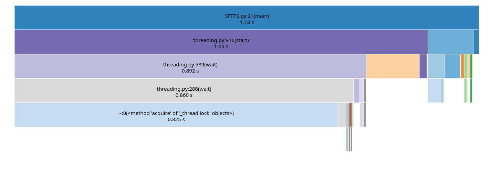

# SFTPS: Simple Fast TCP Port Scanner 

# I wrote this script without using `threading`, after testing I found it takes about 9 seconds, So I added `threading` to make it faster 

## Without Threading 


### [Profiling file](profiling.prof)
```bash 
snakeviz profiling.prof
```

## With Threading 


### [Profiling file](profiling_threading.prof)


```bash 
snakeviz profiling_threading.prof

```
