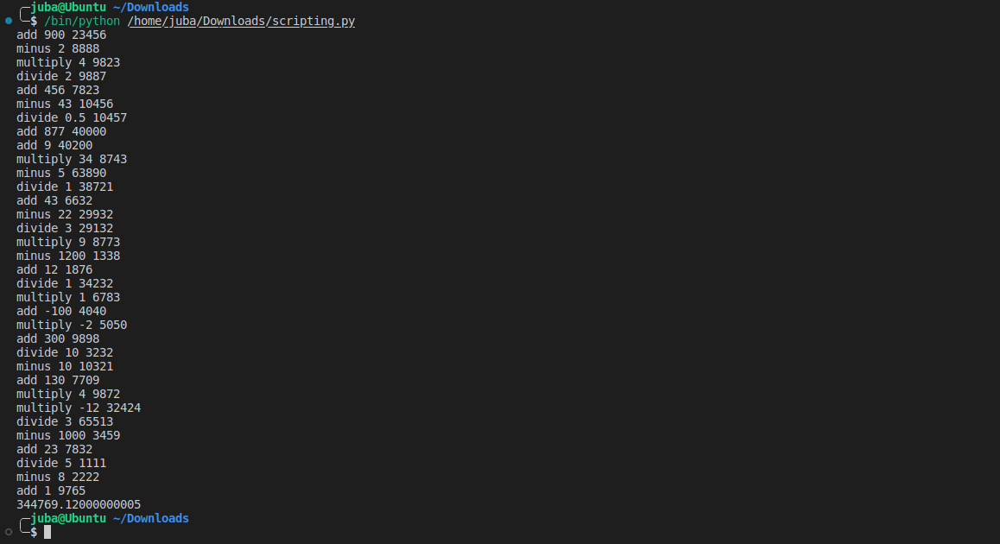

# Scripting Room 

[Room Link](https://tryhackme.com/room/scripting)


## Task 1 [Easy] Base64 
[50-Decoder](50-decoder.py)


> - This file has been base64 encoded 50 times - write a script to retrieve the flag. Here is the general process to do this:
> 
>   - read input from the file
> 
>   - use function to decode the file
> 
>   - do process in a loop
> 
> - Try do this in both Bash and Python!
>
```python
from base64 import b64decode

text: str

# read the file content
with open('b64.txt', 'r') as file:  
    text = file.readline()

# Decode 50 times 
for i in range(50):
    text = b64decode(text)
    
print(text.decode())
```


> What is the final string?
> HackBack2019=


## Task 2 [Medium] Gotta Catch em All 
[Gotta Catch em All](Gotta-Catch-em-All.py)
> You need to write a script that connects to this webserver on the 
correct port, do an operation on a number and then move onto the next 
port. 0.
> 
> The format is: *operation, number, next port.*
> 
> For example the website might display, add 900 3212 which would be: add 900 and move onto port 3212.
> 
> Then if it was minus 212 3499, you'd minus 212 (from the previous number which was 900) and move onto the next port 3499
> 
> Do this until you the page response is STOP (or you hit port 9765).
> 
> Each
 port is also only live for 4 seconds. After that it goes to the next 
port. You might have to wait until port 1337 becomes live again...
> 
> Go to: http://<machines_ip>:3010 to start...
> 
> General Approach(it's best to do this using the sockets library in Python):
> 1. Create a socket in Python using the [sockets](https://docs.python.org/3/howto/sockets.html) library
> 2. Connect to the port
> 
> 3. Send an operation
> 
> 4. View response and continue
>



> Once you have done all operations, what number do you get (rounded to 2 decimal places at the end of your calculation)?
> 344769.12

